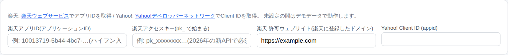

# 楽天・Yahoo! APIキー 無料発行ガイド

このツールで実際の商品を検索できるようにするための、APIキー(利用許可証のような文字列)の
取得手順を1ステップずつ説明します。**どちらも無料で、クレジットカード登録も不要**です。
所要時間はそれぞれ5〜10分です。

> 📖 Amazon相場の自動取得に使う**KeepaのAPIキー(有料)**の取り方は、
> 別冊の **[Keepa APIキー取得ガイド(画面付き)](KEEPA_API_GUIDE.md)** を参照してください。

> 📌 **このガイドに楽天・Yahoo!のサイト画面のスクリーンショットがない理由**:
> キーの発行画面は、ご本人のアカウントでログインした後にしか表示されないためです。
> その代わり、各画面の「どこに何が表示され、何を押すか」をボタンの文言レベルで説明します。
> ※サイトのデザイン・文言は変更されることがあります(本ガイドは2026年6月時点)。

## 事前に用意するもの

| 取得するもの | 必要なアカウント |
| --- | --- |
| 楽天アプリID | 楽天会員ID(楽天市場で買い物に使うIDと同じ。なければ無料登録) |
| Yahoo! Client ID | Yahoo! JAPAN ID(なければ無料登録) |

---

## Part 1: 楽天のキー発行(5〜10分)

> 📌 楽天のAPIは**2026年2月に全面リニューアル**されました。現在は
> 「**アプリケーションID(ハイフン入りの英数字)**」と「**アクセスキー(pk_で始まる文字列)**」の
> **2つセット**で使う方式です。古い解説記事(20桁の数字のアプリID)とは画面が違うので注意してください。

### STEP 1: サイトを開いてログイン

ブラウザで **[webservice.rakuten.co.jp](https://webservice.rakuten.co.jp/)**(楽天ウェブサービス/Rakuten Developers)を開き、
右上からログインします(普段楽天市場で使っているIDでOK)。
画面が英語の場合は言語切替で日本語にできます。

### STEP 2: 新規アプリを作成

右上の「**+ アプリID発行**」(英語表示なら「**+ New App**」)をクリックします。

### STEP 3: フォームを入力

| 項目 | 入力・選択する内容 |
| --- | --- |
| アプリ名 | 好きな名前でOK(例: `せどり管理ツール`) |
| 必要とされるQPS(1秒あたりの必要量) | `1`(個人利用では十分です) |
| APIアクセススコープ | 「**楽天市場API**(製品検索と情報へのアクセス)」**だけ**にチェック |
| 許可されたウェブサイト | `example.com` と入力(⚠️この欄はドメイン形式しか受け付けません。`http://`や`:5050`付きは弾かれます) |

入力したら規約に同意して作成ボタンを押します。

### STEP 4: 発行された2つのキーをコピー

完了画面(またはアプリ詳細画面)に表示される次の**2つ**をコピーします。

| 名前 | 形式の例 | ツールのどこに貼るか |
| --- | --- | --- |
| アプリケーションID | `10013719-5b44-4bc7-…`(ハイフン入り英数字) | 設定 →「楽天アプリID」 |
| アクセスキー | `pk_xxxxxxxxxxxx…`(pk_で始まる) | 設定 →「楽天アクセスキー」 |

> 💡 「アフィリエイトID」も表示されますが今回は使いません。
> ⚠️ ツールの設定にある「**楽天 許可ウェブサイト**」は、STEP 3で登録したドメインと
> 同じもの(`https://example.com`)にしてください(初期値のままでOKです)。
> 楽天側に別のドメインを登録した場合だけ、それに合わせて書き換えます。

---

## Part 2: Yahoo! Client IDの発行(5〜10分)

### STEP 1: サイトを開く

ブラウザで **[e.developer.yahoo.co.jp/register](https://e.developer.yahoo.co.jp/register)** を開きます。
(Yahoo!デベロッパーネットワークのトップから行く場合は、右上のメニューから
「アプリケーションの管理」→「新しいアプリケーションを開発」です)

### STEP 2: Yahoo! JAPAN IDでログイン

ログイン画面が出たら、お持ちのYahoo! JAPAN IDでログインします。

> 💡 初めて開発者登録をする場合、最初にメールアドレスなどの開発者情報の登録を
> 求められることがあります。画面の案内に従って入力してください(無料です)。

### STEP 3: アプリケーション情報を入力

「新しいアプリケーションを開発」というフォームが表示されます。

| 項目 | 選ぶ・入力する内容 |
| --- | --- |
| ID連携利用有無 | **「ID連携を利用しない」を選択**(⚠️ここが一番のつまずきポイント。「利用する」を選ぶと余計な入力が増えます) |
| アプリケーションの種類 | 選択肢が出る場合は「**クライアントサイド**」を選択 |
| アプリケーション名 | 好きな名前でOK(例: `せどり管理ツール`) |
| サイトURL | 任意。入れる場合は `http://127.0.0.1:5050` |
| メールアドレス | ご自分のアドレス |

「ガイドラインに同意しますか」にチェックを入れ、「**確認**」→ 内容を確認して「**登録**」を押します。

### STEP 4: Client IDをコピー

完了画面に「**Client ID**」として、**`dj00` のような英数字で始まる長い文字列**が表示されます。
これが目的のキーです。コピーしてください。

> 💡 「シークレット」も表示される場合がありますが、**今回は使いません**。
> 後から確認するには「アプリケーションの管理」ページを開きます。

---

## Part 3: ツールに貼り付ける(1分)

1. ツールを起動し、メニューの「**設定**」を開く
2. 一番上の「仕入元API」の欄に、コピーした2つのキーを貼り付ける

| 欄 | 貼り付けるもの |
| --- | --- |
| 楽天アプリID(アプリケーションID) | Part 1の**ハイフン入り英数字のID** |
| 楽天アクセスキー | Part 1の**pk_ で始まる文字列** |
| 楽天 許可ウェブサイト | 楽天に登録したドメイン(`https://example.com` のままでOK) |
| Yahoo! Client ID (appid) | Part 2でコピーした**dj00…で始まる長い文字列** |

3. ページ下の「**設定を保存**」を押す

## 動作確認

「商品リサーチ」を開いてキーワード(例: ゲームソフト)で検索してください。

- ✅ **成功**: 今まで出ていた黄色い「デモデータで動作しています」の表示が消え、
  実際の楽天市場・Yahoo!ショッピングの商品(クリックすると商品ページが開く)が表示されます
- ❌ **「楽天API エラー」等が出る場合**: キーの貼り間違いです。コピーし直してください
  (**前後に余分な空白が入っていないか**に注意)

## よくあるつまずき

| 症状 | 原因と対処 |
| --- | --- |
| 楽天の「許可されたウェブサイト」が何度も弾かれる | ドメインだけを入力します(`example.com`)。URL形式(`http://〜`)やポート番号付きはエラーになります |
| 楽天で「400エラー」が出る | アプリIDかアクセスキーの貼り間違い・空白混入。**2つともセットで必要**です(片方だけでは動きません) |
| 楽天で「401/403エラー」が出る | ツール設定の「楽天 許可ウェブサイト」が、楽天に登録したドメインと一致していません。同じものにしてください |
| Yahoo!でどのキーを使うか分からない | 使うのは「**Client ID**」だけ。「シークレット」は使いません |
| 貼り付けたのにデモデータのまま | 「設定を保存」の押し忘れ、またはキーの前後の空白。楽天・Yahoo!どちらか一方だけでも動きます(入れた方のモールだけ検索されます) |
| 発行してすぐ使える? | はい。楽天・Yahoo!とも発行直後から使えます |
