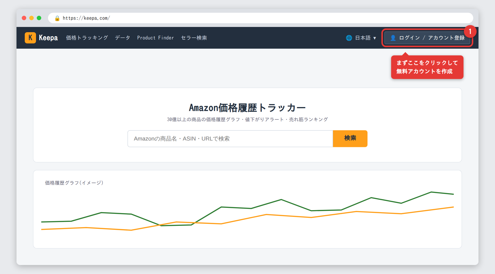
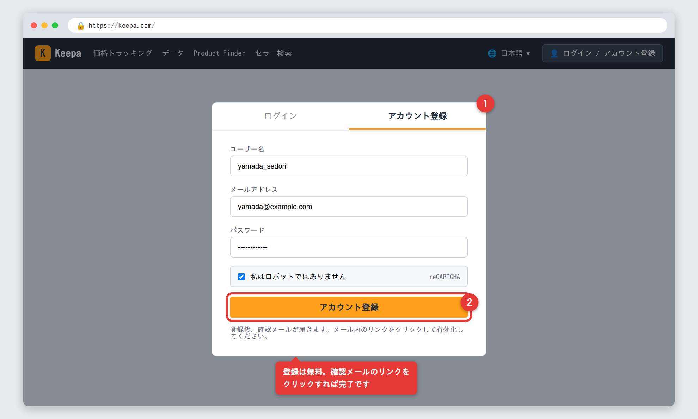
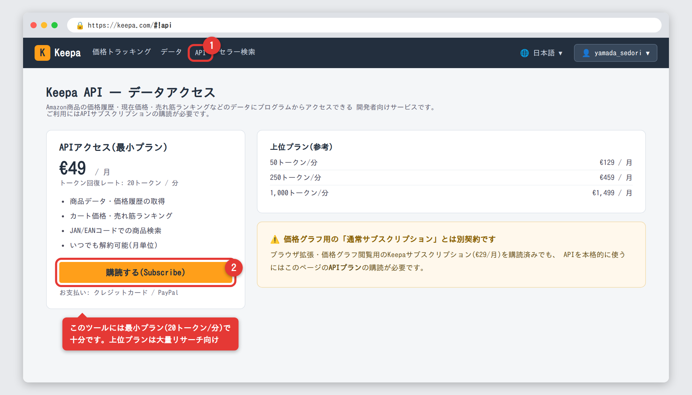
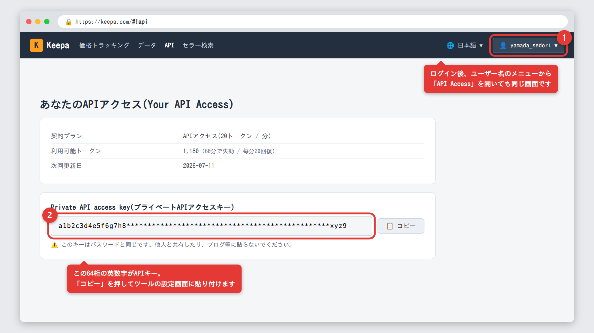
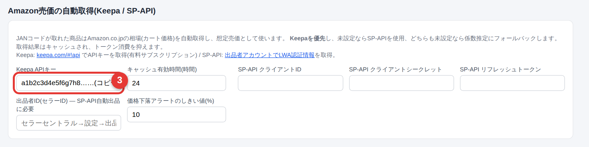

# Keepa APIキー 取得ガイド(画面付き)

このツールの「**Amazon相場の自動取得**」(JANコード → Amazon.co.jpのカート価格・売れ筋ランキング)を
有効にするための、Keepa APIキーの取得手順を画面付きで説明します。

キーを登録すると、リサーチ結果の想定売価が「係数推定」から
**「Amazon相場」**(実際に売れている価格)に変わり、
**相場必須モードと組み合わせて“確実に利益が出る商品だけ”を候補にできる**ようになります。

> 📌 **掲載画像について**: Keepaのサイトはログインや契約状態によって表示が変わるため、
> 本ガイドの Keepa 画面は**実際のサイト構成を元にした再現イメージ**です(枠の赤色は本ガイドの注釈)。
> デザイン・文言・料金は変更されることがあります。**最終的な料金は必ず公式ページでご確認ください**
> (本ガイドは2026年6月時点の情報です)。

## はじめに: 費用と所要時間

| 項目 | 内容 |
| --- | --- |
| アカウント作成 | 無料(メールアドレスのみ) |
| APIプラン | **有料・月額制**。最小プランは **€49/月**(約9,000円前後、為替による)で、このツールには十分 |
| 支払い方法 | クレジットカード / PayPal |
| 所要時間 | 10〜15分 |

> 💡 **お金をかけたくない場合の代替**: Amazon出品者アカウント(大口)をお持ちなら、
> 無料の **SP-API** でも同じ機能が使えます(設定はやや複雑)。どちらか一方でOKです。

---

## STEP 1: Keepaアカウントを作成(無料)

ブラウザで **[keepa.com](https://keepa.com/)** を開きます。
画面が英語の場合は、右上の言語メニュー(🌐)から「日本語」を選べます。

右上の「**ログイン / アカウント登録**」をクリックします。

表示されたダイアログで「**アカウント登録**」タブを選び、
ユーザー名・メールアドレス・パスワードを入力して登録します。

登録したメールアドレスに**確認メール**が届くので、メール内のリンクをクリックして
アカウントを有効化し、Keepaにログインした状態にしておきます。

---

## STEP 2: APIプランを購読する

ログインした状態で、APIページ **[keepa.com/#!api](https://keepa.com/#!api)** を開きます
(上部メニューの「API」/「Data」関連メニューからも行けます)。

プラン一覧から**最小プラン(€49/月・20トークン/分)**を選び、
「**購読する(Subscribe)**」を押して、クレジットカードまたはPayPalで支払います。

> ⚠️ **一番のつまずきポイント**: Keepaには、価格グラフ閲覧・ブラウザ拡張用の
> 「**通常サブスクリプション**」(€29/月)と、プログラムからデータを取る
> 「**APIプラン**」(€49/月〜)の**2種類の契約**があります。
> このツールで使うのは **APIプラン** の方です。通常サブスクリプションだけでは
> トークンがほとんど付与されず、リサーチには足りません。
>
> 💰 月額約9,000円は安くありませんが、「相場の裏付けがある商品だけ仕入れる」ことで
> 仕入れミス1〜2回分で元が取れる、と考えるのが一般的です。
> まず1ヶ月だけ試す使い方もできます(月単位でいつでも解約可能)。

---

## STEP 3: APIキーをコピーする

購読が完了すると、同じ **[keepa.com/#!api](https://keepa.com/#!api)** のページに
「**Private API access key**(プライベートAPIアクセスキー)」として
**64桁の英数字**が表示されます。これが目的のキーです。コピーしてください。

(画面右上の自分のユーザー名のメニューから「**API Access**」を開いても同じ画面に行けます)

> ⚠️ このキーは**パスワードと同じ**扱いです。他人に教えたり、SNS・ブログに貼らないでください。

---

## STEP 4: ツールに貼り付ける(1分)

1. ツールを起動し、メニューの「**設定**」を開く
2. 「**Amazon売価の自動取得(Keepa / SP-API)**」の「**Keepa APIキー**」欄に、
   コピーしたキーを貼り付ける(▼ こちらはツールの実際の画面です)

3. ページ下の「**設定を保存**」を押す

### 動作確認

「商品リサーチ」でキーワード検索するか、「JANコードからAmazon相場を単体検索」に
手元の商品のJAN(例: `4902370542912`)を入れて「Amazon相場を調べる」を押してください。

- ✅ **成功**: 想定売価に緑の「**Amazon相場**」バッジとランキングが表示されます
- ❌ **「Keepa API エラー」が出る**: キーの貼り間違い・前後の空白混入を確認してください

---

## トークンの仕組みと、このツールでの消費量の目安

Keepa APIは「**トークン**」という単位で利用量が決まります。

- 最小プランでは**毎分20トークン**が回復し、未使用分は60分でなくなります
- **商品1件の相場取得 ≒ 1トークン**が目安です

このツールはトークンを節約する作りになっています。

- 取得した相場は**24時間キャッシュ**され、同じ商品の再検索ではトークンを消費しません
  (キャッシュ時間は設定で変更可能)
- 目安: 保存キーワード10個 × 50件 = 最大500商品の自動リサーチでも、
  初回が約500トークン(約25分で全回復)、**2回目以降はほぼ0トークン**です

最小プラン(20トークン/分)で個人のリサーチには十分です。

---

## よくあるつまずき

| 症状 | 原因と対処 |
| --- | --- |
| APIページにキーが表示されない | APIプランが未購読です。STEP 2の購読(€49/月〜)が完了しているか確認してください |
| 通常サブスク(€29)を契約したのにリサーチで相場が出ない | 契約の種類が違います。「APIプラン」を購読してください(2種類は別契約です) |
| 「Keepa API エラー」が出る | キーの貼り間違いか前後の空白混入。コピーし直してください |
| 検索の途中から相場が付かなくなった | トークン切れです。数分〜数十分待つと回復します(検索件数を減らす・キャッシュ時間を長くするのも有効) |
| 楽天の商品に相場が付かない | 楽天APIはJANコードを返さないため自動照合できません。リサーチ画面の「JANコード単体検索」で手動確認するか、Yahoo!ショッピング経由の商品をご利用ください |
| 解約したい | Keepaにログイン → APIページまたはアカウントのサブスクリプション管理から解約できます(月単位) |

## 参考リンク

- [Keepa APIページ(公式・料金と購読)](https://keepa.com/#!api)
- ツール側の設定方法: [かんたん操作マニュアル](MANUAL.md) / 楽天・Yahoo!のキーは [APIキー無料発行ガイド](API_GUIDE.md)
