# 電脳せどり管理ツール かんたん操作マニュアル

はじめて使う方向けに、実際の画面を見ながら操作の流れを説明します。

---

## 1. このツールでできること

「ネットで安く仕入れて、別の場所で高く売る(電脳せどり)」の作業を、ぜんぶ1つの画面で管理できます。

| やりたいこと | 使う画面 |
| --- | --- |
| 儲かる商品を探したい | 商品リサーチ |
| 探すのを自動化したい | 商品リサーチ(自動リサーチ) |
| 店頭やスマホでサッと相場を調べたい | バーコード |
| 「たまたま高いだけ」の商品を見抜きたい | 候補商品 → 📈価格履歴 |
| いつ買うのが一番お得か知りたい | 購入日判断 |
| 買ったもの・売れたものを記録したい | 仕入管理・売上管理 |
| 出品するタイトル・説明文・値段を作りたい | 出品作成 |
| 出品用の写真を整えたい | 出品作成 → 画像整形 |
| 在庫の値下がりに気づきたい | ダッシュボード(価格改定アラート) |
| 梱包材などの経費を記録したい | 経費 |
| 今月あといくら仕入れられるか知りたい | 資金繰り |
| 今月いくら儲かったか見たい | ダッシュボード・レポート |

### 基本の流れ

```
 ① リサーチ/バーコードで商品を探す
       ↓
 ② 良さそうな商品を「候補」に登録(価格履歴で相場の安定を確認)
       ↓
 ③ 「購入日判断」でお得な日に仕入れる → 仕入登録
       ↓
 ④ 「出品作成」でタイトル・説明文・値段を自動生成して出品
       ↓
 ⑤ 売れたら売上登録(利益は自動計算)/ 経費も記録
       ↓
 ⑥ レポート・資金繰りで振り返り、値下がりはアラートで検知
```

---

## 2. はじめる(起動方法)

このツールはお使いのパソコンの中で動く小さなアプリです。
最初に一度だけ準備(①と②)をすれば、**2回目からはファイルをダブルクリックするだけ**で使えます。

### 準備① Python を入れる(最初の1回だけ)

このツールは「Python(パイソン)」という無料ソフトの上で動きます。

1. ブラウザで [python.org/downloads](https://www.python.org/downloads/) を開く
2. 黄色い「**Download Python 3.x.x**」ボタンを押してダウンロード
3. ダウンロードしたファイルをダブルクリックしてインストール
   - **Windowsの方**: 最初の画面の下にある
     「**Add python.exe to PATH**」に**必ずチェック**を入れてから「Install Now」
     (これを忘れると起動できません。忘れた場合は入れ直せばOKです)
   - **Macの方**: そのまま「続ける」で進めればOK

### 準備② ツール一式をパソコンに置く(最初の1回だけ)

1. このツールのGitHubページで、緑色の「**Code**」ボタン →「**Download ZIP**」を押す
2. ダウンロードしたZIPを右クリック →「すべて展開」(Macはダブルクリック)
3. できたフォルダを、デスクトップなどわかりやすい場所に置く

### 起動する(毎回これだけ)

フォルダの中の、お使いのパソコンに合ったファイルを**ダブルクリック**します。

| パソコン | ダブルクリックするファイル |
| --- | --- |
| Windows | `start_windows.bat` |
| Mac | `start_mac.command` |

すると——

1. 黒い画面(ターミナル)が開きます。**初回だけ**自動で部品のインストールが走ります(1〜2分)
2. 続けて**ブラウザが自動で開き**、ツールの画面が表示されます
3. 開かない場合は、ブラウザに `http://127.0.0.1:5050` と入力してください

> ⚠️ **使っている間、黒い画面は閉じないでください**(最小化はOK)。
> 黒い画面=ツール本体です。終わるときはこの画面を閉じるだけ。
> 入力したデータはフォルダ内の `sedori.db` に保存されているので、次回も続きから使えます。

> 💡 Macで「開発元が未確認のため開けません」と出たら、
> ファイルを**右クリック →「開く」→「開く」**を選んでください(初回のみ)。

### (参考)コマンドで起動する場合

パソコン操作に慣れている方は、フォルダでターミナルを開いて次の2行でも起動できます。

```bash
pip install -r requirements.txt
python app.py
```

---

## 3. 画面の全体像

最初に開くと「ダッシュボード」が表示されます。上の黒いバーがメニューです。

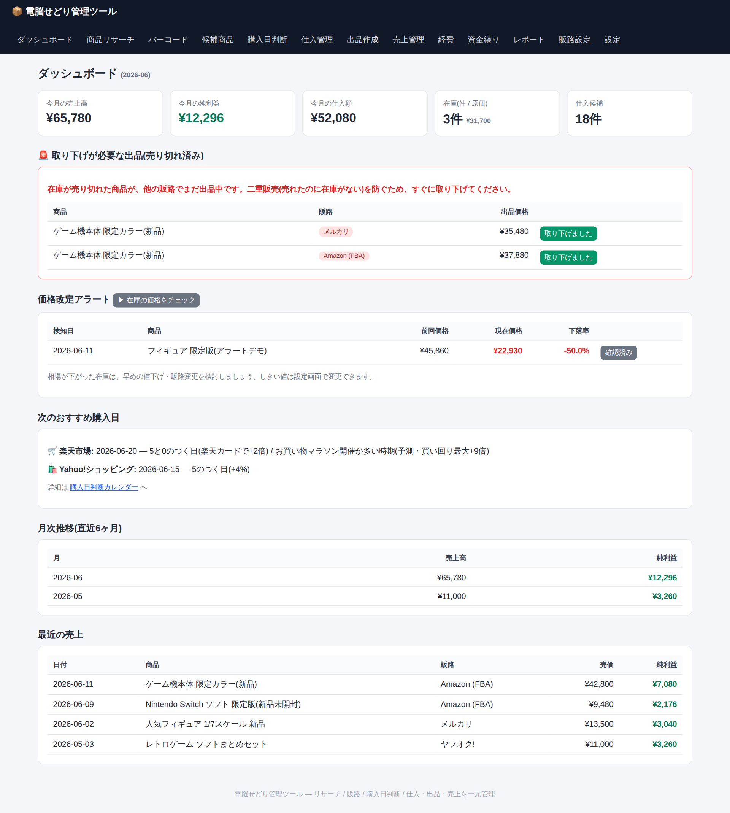

- **今月の売上高・純利益・仕入額** … 今月の成績がひと目でわかります
- **価格改定アラート** … 在庫商品のAmazon相場が下がっていたらここに警告が出ます(詳しくは第13章)
- **次のおすすめ購入日** … 楽天・Yahoo!それぞれの「一番お得に買える日」を自動表示
- **月次推移・最近の売上** … 直近の実績

---

## 4. 最初にやる設定(5分)

### 4-1. 販路設定 — 「どこで売るか」の手数料を確認

メニューの「販路設定」を開きます。Amazon・メルカリ・ヤフオク!などが
最初から登録済みなので、**自分が使う販路の数字を確認するだけでOK**です。

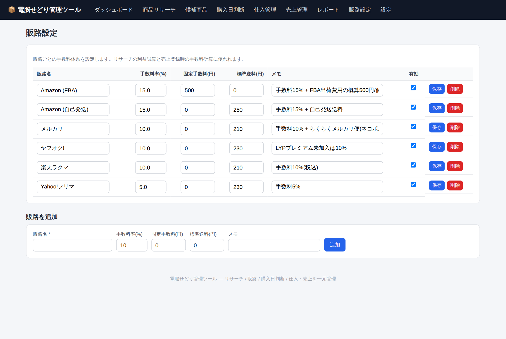

- **手数料率(%)** … 売れたときに販路に取られる手数料(例: メルカリは10%)
- **固定手数料(円)** … 1個売るごとにかかる固定費(例: FBAの出荷費用)
- **標準送料(円)** … 発送にかかる送料のめやす

> 💡 ここの数字を使って、リサーチ時の利益が自動計算されます。

### 4-2. 設定 — APIキーと利益の条件

メニューの「設定」を開きます。

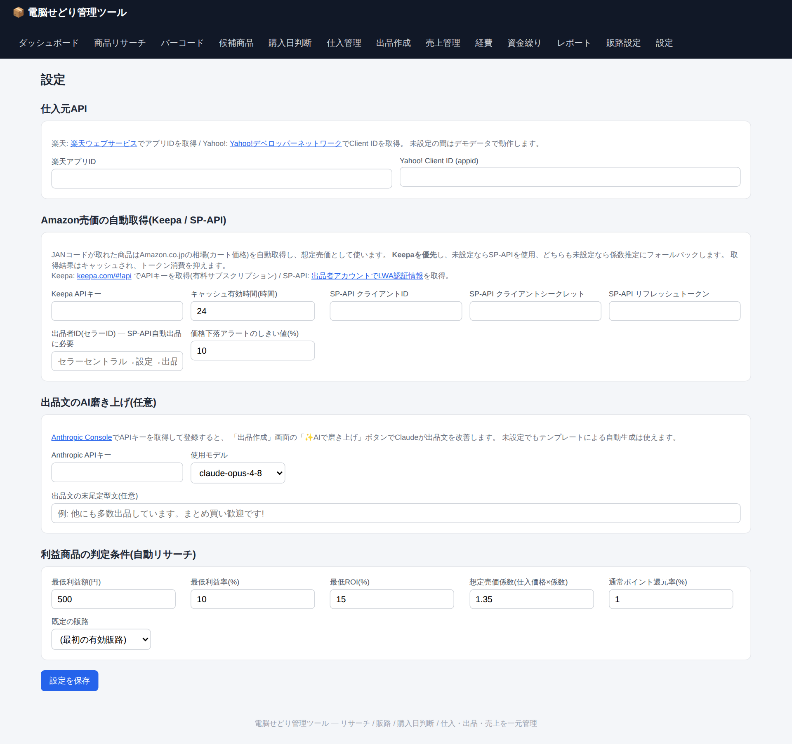

**① 仕入元API(無料)**
- 楽天アプリID … [楽天ウェブサービス](https://webservice.rakuten.co.jp/)で無料発行
- Yahoo! Client ID … [Yahoo!デベロッパーネットワーク](https://developer.yahoo.co.jp/)で無料発行

> ⚠️ 未設定でも「デモデータ」で全機能を試せます。まず触ってみて、慣れたらAPIキーを入れましょう。

**② Amazon売価の自動取得(任意)**
- Keepa APIキー(有料)または Amazon SP-API の認証情報を入れると、
  商品のJANコードから**Amazonでの実際の販売価格**を自動で取ってきて、想定売価に使います。
- SP-APIで**自動出品**まで行う場合は「出品者ID(セラーID)」も入力します。
- 「価格下落アラートのしきい値」は、何%値下がりしたら警告するかの設定です(初期値10%)。

**③ 出品文のAI磨き上げ(任意)**
- Anthropic APIキーを登録すると、出品作成画面でClaude(AI)が文面を改善してくれます。

**④ 利益商品の判定条件**
- 「利益500円以上・利益率10%以上・ROI 15%以上」が初期値。
  自動リサーチはこの条件を満たした商品だけを拾います。お好みで変更してください。

---

## 5. 商品リサーチ(手動で探す)

メニューの「商品リサーチ」でキーワードを入れて「検索」を押すと、
仕入候補が利益計算つきで一覧表示されます。

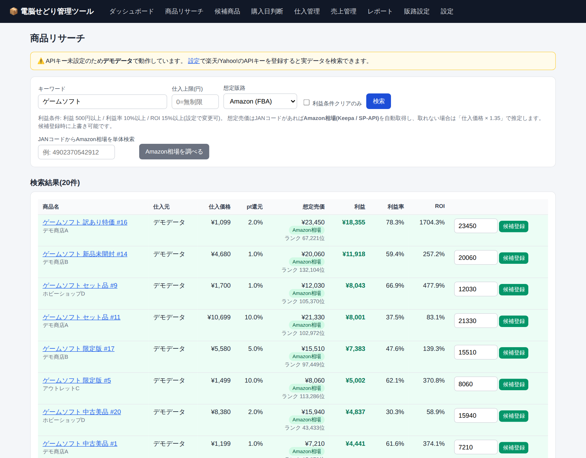

### 結果の見方

| 列 | 意味 |
| --- | --- |
| 仕入価格 | 今その商品を買える値段 |
| pt還元 | 仕入時にもらえるポイント(実質値引きとして計算) |
| 想定売価 | 売れるであろう値段。<span style="color:#065f46">**「Amazon相場」**</span>バッジ付きはAmazonの実勢価格、「係数推定」はざっくり計算 |
| 利益 | 売価 − 手数料 − 送料 − 実質仕入額。**緑の行は利益条件クリア** |
| 利益率 | 利益 ÷ 売価 |
| ROI | 利益 ÷ 実質仕入額(投資効率。高いほど資金効率が良い) |

気になる商品は右端の **「候補登録」** を押すだけ。隣の数字ボックスで想定売価を
直してから登録することもできます。

---

## 6. 自動リサーチ(探すのを自動化)

リサーチ画面の下のほうにある「自動リサーチ(保存キーワード)」を使います。

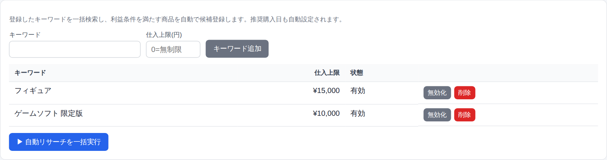

1. よく探すキーワード(例「ゲームソフト 限定版」)と仕入上限額を登録
2. **「▶ 自動リサーチを一括実行」** を押す
3. 登録した全キーワードを一括検索し、**利益条件を満たした商品だけ**が
   自動で「候補商品」に登録されます(おすすめ購入日も自動でつきます)

> 💡 朝イチでボタンを1回押すだけで、その日の利益商品リストができあがります。

---

## 7. バーコード仕入れ(スマホでサッと相場確認)

メニューの「バーコード」を開くと、商品のJANコード(バーコードの13桁の数字)から
**Amazon相場と利益をその場で計算**できます。

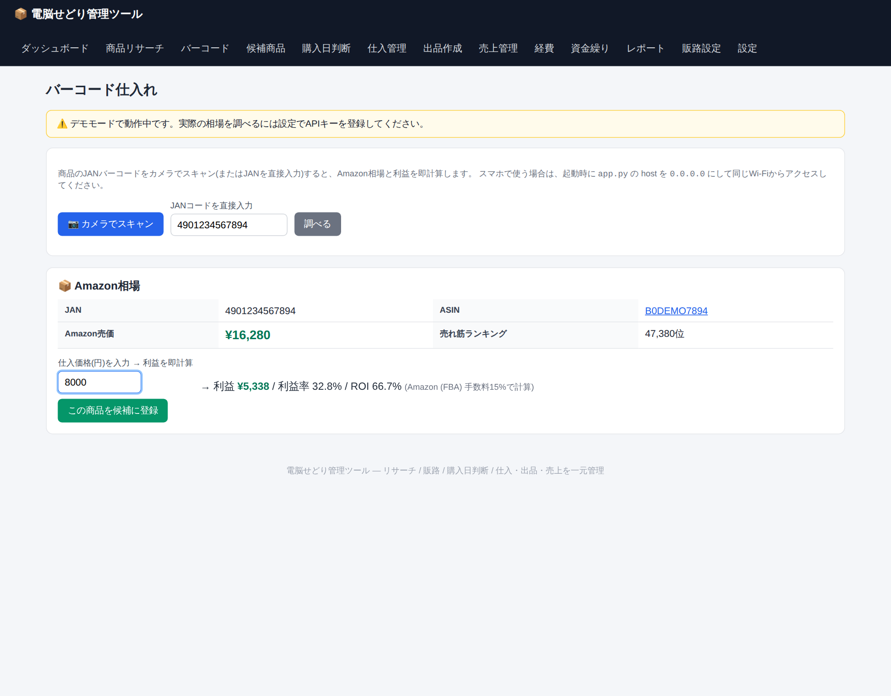

1. 「📷 カメラでスキャン」でバーコードを読み取る(またはJANを直接入力してEnter)
2. Amazon売価・売れ筋ランキングが表示される
3. **仕入価格を入力すると、利益・利益率・ROIがリアルタイムで計算**されます
4. 良ければ「この商品を候補に登録」で候補商品へ

> 💡 スマホで使うには: `app.py` の `host="127.0.0.1"` を `host="0.0.0.0"` に変えて起動し、
> 同じWi-Fiにつないだスマホのブラウザで「パソコンのIPアドレス:5050」を開きます。
> カメラスキャンはAndroidのChromeが確実です(非対応ブラウザでは直接入力を使ってください)。

---

## 8. 候補商品を管理する

メニューの「候補商品」に、登録した商品が利益の大きい順に並びます。

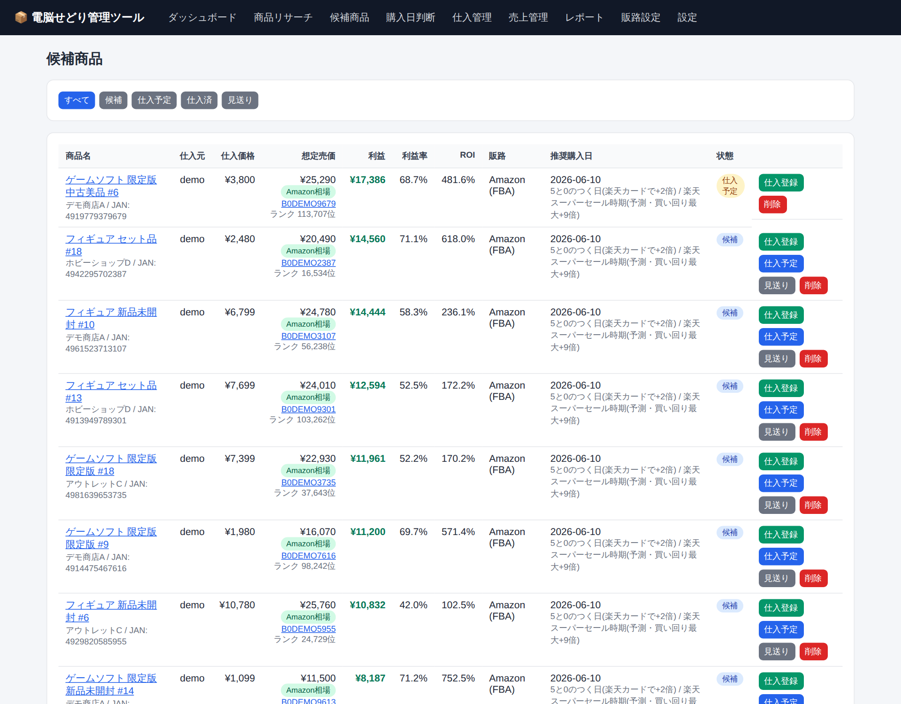

- 状態は **候補 → 仕入予定 → 仕入済**(やめるときは**見送り**)と進めます
- **推奨購入日**列に「いつ買うのがお得か」とその理由が表示されます
- 買うと決めたら **「仕入登録」** ボタンへ

### 📈 価格履歴で「たまたま高いだけ」を見抜く

JAN付きの候補には「📈 価格履歴」ボタンが付きます。直近90日の価格推移がグラフで見られます。

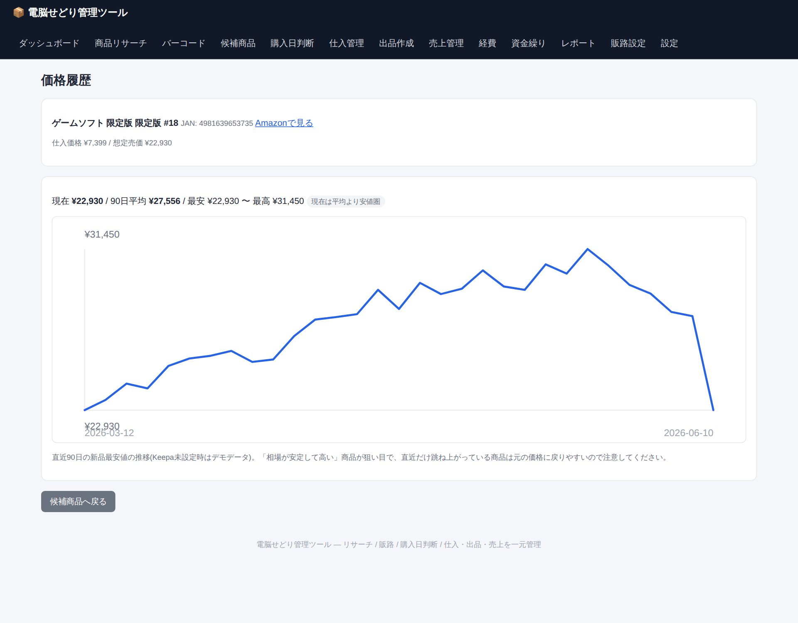

- **「平均水準で安定」** … 相場が安定していて狙い目
- **「⚠ 平均より15%以上高値」** … 一時的な高騰の可能性。今の想定売価を信じて仕入れると、
  元の価格に戻って赤字になりやすいので注意!

---

## 9. 購入日を決める

メニューの「購入日判断」を開くと、今後30日間のセール・ポイントアップ日カレンダーと、
購入待ち商品の推奨購入日が見られます。

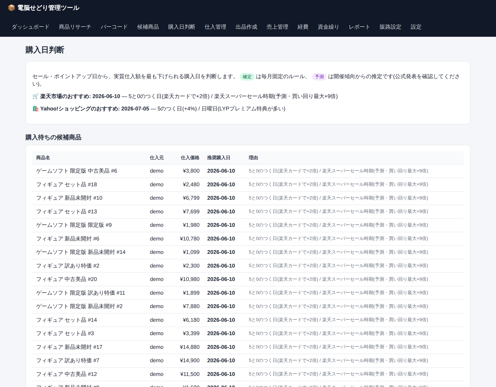

- <span style="color:#065f46">**確定**</span> … 毎月決まっているルール(楽天「5と0のつく日」、Yahoo!「5のつく日」など)
- <span style="color:#6b21a8">**予測**</span> … 開催されることが多い時期(お買い物マラソンなど)。
  **必ず公式の開催告知を確認してから**買ってください
- 黄色の行がおすすめ日です

---

## 10. 仕入を登録する

候補商品の「仕入登録」を押すと、商品名・価格・ポイントが**自動入力された状態**で
フォームが開きます。数量と日付を確認して「登録する」だけです。

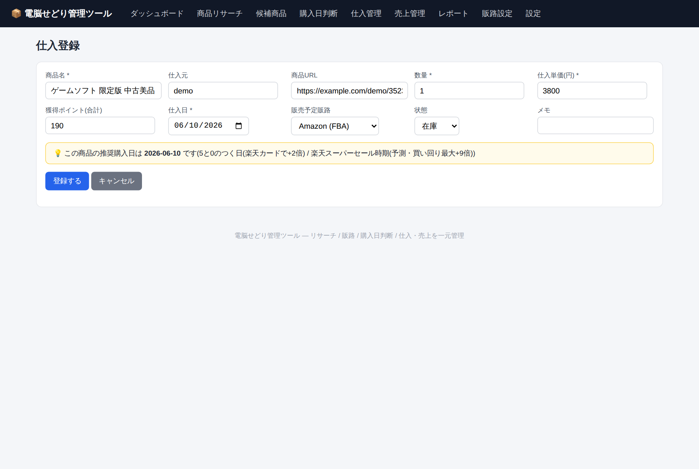

登録した仕入は「仕入管理」に一覧表示されます。

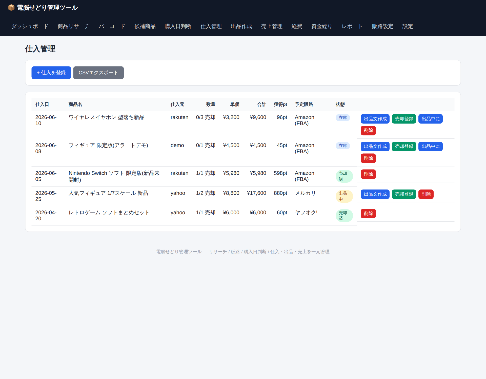

- 状態は **在庫 → 出品中 → 売却済** で管理(出品・売却の操作で自動的に変わります)
- ここから「**出品文作成**」「**売却登録**」へワンクリックで進めます

---

## 11. 出品する(タイトル・説明文・値段を自動作成)

仕入管理の「出品文作成」(またはメニューの「出品作成」)を開きます。

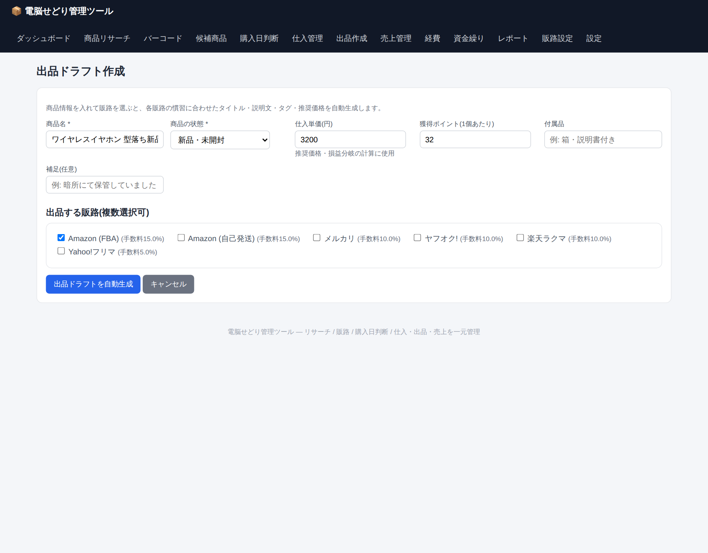

商品の状態・付属品を入れて、**出品したい販路にチェック(複数OK)**して
「出品ドラフトを自動生成」を押すと——

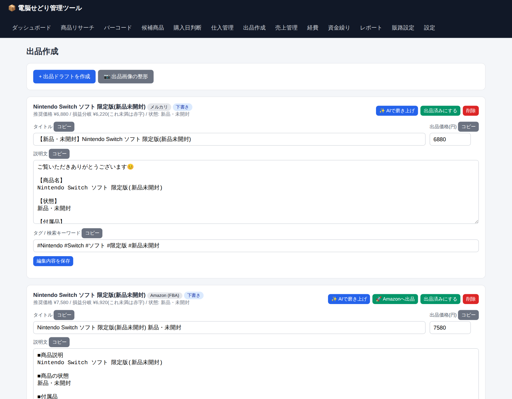

販路ごとの慣習に合わせたドラフトが一括で出来上がります。

- **メルカリ/ラクマ等** … 【状態】付きタイトル+親しみやすい文面+ハッシュタグ
- **Amazon** … 検索キーワード入りタイトル+箇条書きの説明
- **ヤフオク!** … キーワード多めタイトル+注意事項入りの丁寧な文面
- **推奨価格** はAmazon相場(なければ仕入額+目標利益)から自動計算。
  **損益分岐価格(これ未満で売ると赤字)** も出るので、値下げ交渉の下限がわかります
- 各項目の「**コピー**」ボタンで、販路の出品画面に貼り付けるだけ
- **✨AIで磨き上げ** … 設定でAnthropic APIキーを登録すると、Claudeが文面をさらに自然に改善
- **🚀 Amazonへ出品** … SP-APIの認証情報と出品者IDを設定済みなら、Amazonの既存商品ページへの
  相乗り出品をワンクリックで送信できます(送信後はセラーセントラルで反映を確認してください)

### 出品画像の整形

出品作成画面の「📷 出品画像の整形」では、撮影した商品写真を各販路の推奨仕様
(白背景・正方形・規定サイズ)に自動変換できます。

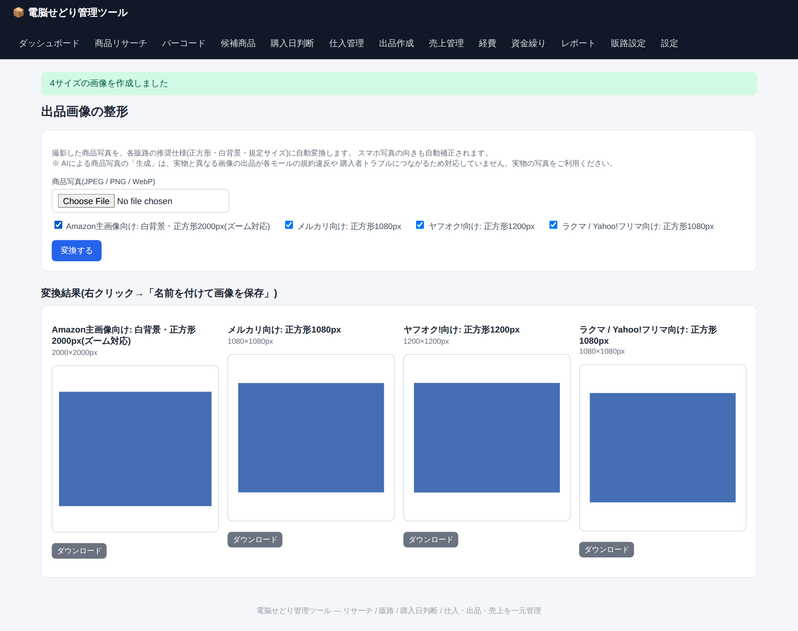

> ⚠️ AIで商品写真を「生成」する機能はありません。実物と異なる画像の出品は
> 規約違反や「写真と違う」クレームにつながるため、実物の写真をご利用ください。

---

## 12. 売れたら売上を登録する

仕入管理の **「売却登録」** を押すと、商品名などが入った状態でフォームが開きます。
**売れた値段と日付を入れるだけ**で、あとは全部自動計算です。

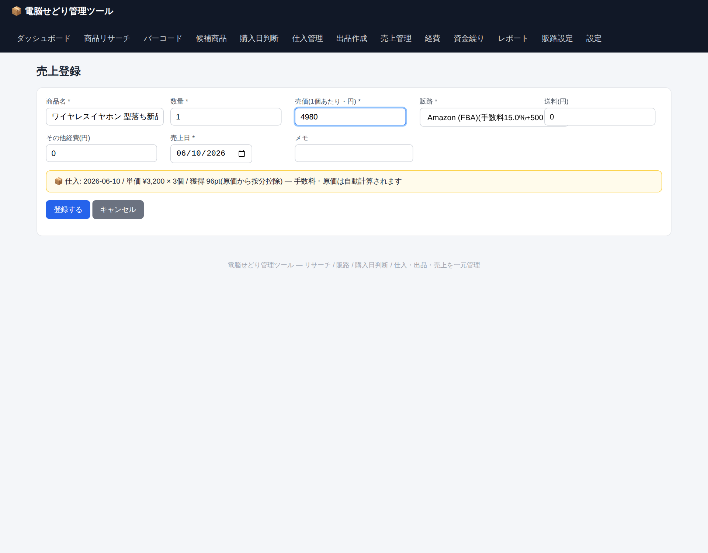

自動で計算されるもの:
- 販路の手数料(販路設定の手数料率・固定費を使用)
- 仕入原価(仕入時にもらったポイント分は割引いて計算)
- **純利益**

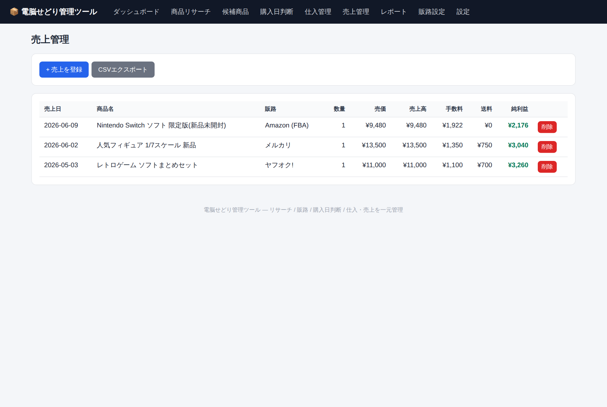

---

## 13. 在庫の値下がりを見張る(価格改定アラート)

ダッシュボードの「**▶ 在庫の価格をチェック**」を押すと、在庫商品(JAN付き)の
Amazon相場をまとめて再取得し、**しきい値(初期値10%)以上値下がりした商品を警告**します。

ダッシュボード上部にこのように表示されます(マニュアル冒頭のスクリーンショット参照):
前回価格・現在価格・下落率が一覧になり、「確認済み」で消せます。

> 💡 相場が下がった在庫は塩漬けになりがちです。アラートが出たら早めの値下げ・
> 販路変更(メルカリ→ヤフオクなど)を検討しましょう。しきい値は設定画面で変更できます。

---

## 14. 経費を記録する

メニューの「経費」で、梱包材・送料・月額利用料などを記録します。

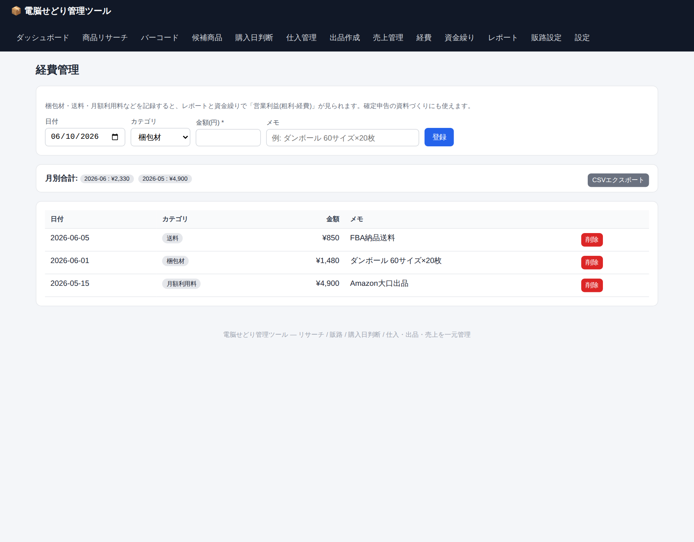

- カテゴリを選んで金額を入れるだけ。月別合計も自動集計
- 記録した経費は**レポートと資金繰りの「営業利益(粗利−経費)」に自動反映**されます
- CSVエクスポートで確定申告の資料づくりにも使えます

---

## 15. 資金繰りを管理する

メニューの「資金繰り」で、お金の流れを一画面で確認できます。

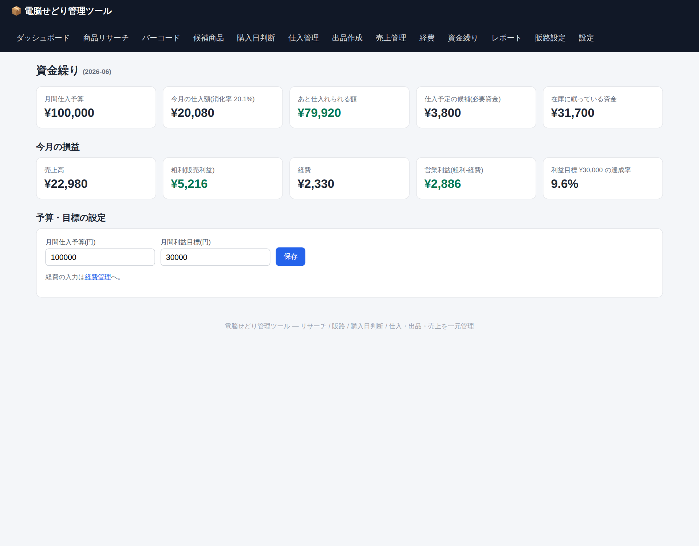

- **月間仕入予算** を設定すると、今月の消化率と「あと仕入れられる額」が出ます
- 「仕入予定」にした候補の必要資金が残り予算を超えると警告が出ます
- **在庫に眠っている資金** … 売れていない仕入の合計。多すぎたら出品・値下げを
- **利益目標の達成率** … 月間利益目標に対する営業利益の進捗

---

## 16. レポートで振り返る

メニューの「レポート」で、月ごとの売上・仕入・粗利・経費・**営業利益**と、
販路別の成績が確認できます。

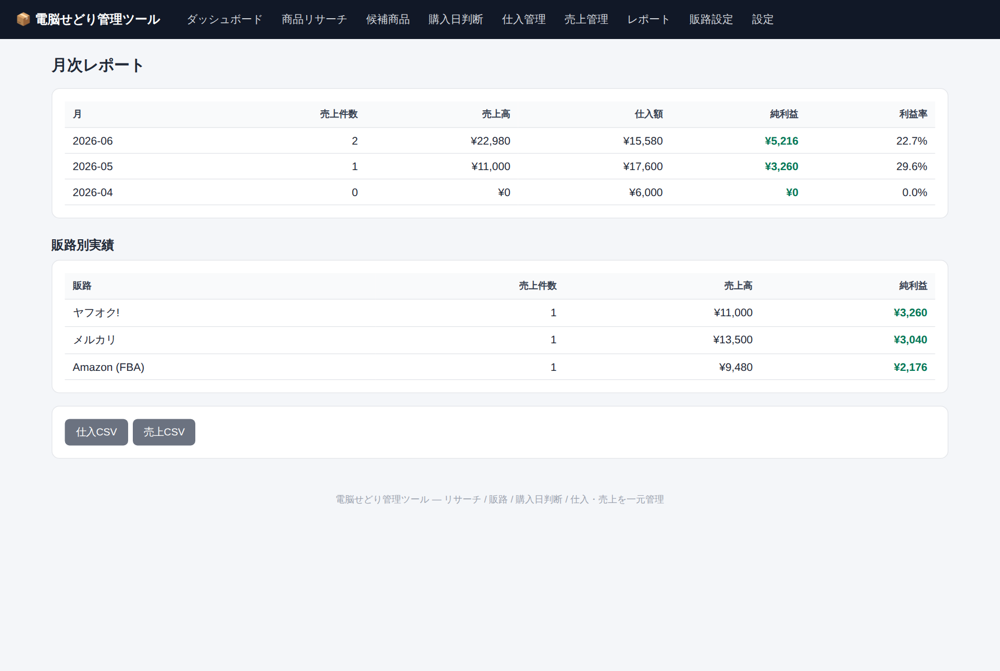

仕入・売上・経費はそれぞれCSVでダウンロードできます(Excel対応)。

---

## 17. 用語集

| 用語 | 意味 |
| --- | --- |
| 利益(粗利) | 売価 −(手数料+送料+経費)− 実質仕入額 |
| 営業利益 | 粗利 − 経費(梱包材・月額利用料など)。本当の手残り |
| 実質仕入額 | 仕入価格からポイント還元分を引いた、本当の支出額 |
| 利益率 | 利益 ÷ 売価。20%以上なら優秀といわれます |
| ROI | 利益 ÷ 実質仕入額。「使ったお金が何%増えて返ってくるか」 |
| 想定売価 | 売れるであろう値段。Amazon相場(実勢価格)か係数推定 |
| 損益分岐価格 | これ未満で売ると赤字になる価格。値下げの下限 |
| カート価格 | Amazonで「カートに入れる」ボタンに表示される価格 |
| 売れ筋ランキング | Amazonのカテゴリ内順位。小さいほどよく売れている |
| JANコード | 商品バーコードの13桁の番号。商品の特定に使う |
| ASIN | Amazonの商品ID。相乗り出品はこのIDに対して行う |
| 相乗り出品 | Amazonの既存商品ページに自分も出品者として参加すること |
| 買い回り | 楽天のセールで複数ショップ購入するとポイント倍率が上がる仕組み |

---

## 18. よくある質問

**Q. 起動用ファイルをダブルクリックしても、黒い画面が一瞬で閉じてしまいます**
A. ほとんどの場合、Pythonインストール時に「Add python.exe to PATH」の
チェックを忘れたのが原因です。python.orgからもう一度インストールし直して、
チェックを入れてから「Install Now」を押してください。

**Q. 間違えて黒い画面を閉じてしまいました**
A. ツールが止まるだけで、データは消えません。
もう一度起動用ファイルをダブルクリックすれば続きから使えます。

**Q. APIキーがなくても使えますか?**
A. 使えます。デモデータで全機能を体験できます。実際の商品を検索するには
楽天/Yahoo!の無料APIキーを「設定」画面に入れてください。

**Q. 「係数推定」の想定売価は信用していいですか?**
A. あくまでざっくりの目安です。Keepa APIキーかSP-APIを設定すれば
自動でAmazon実勢価格になります。さらに「📈価格履歴」で相場が安定しているかも確認しましょう。

**Q. 「予測」と出ているセールは確実に開催されますか?**
A. いいえ。お買い物マラソン等は開催時期の傾向からの推定です。
購入前に必ず楽天・Yahoo!の公式告知を確認してください。

**Q. 「🚀 Amazonへ出品」を押したのに商品が出てきません**
A. SP-APIへの送信は「受理」されてからAmazon側での反映に時間がかかることがあります。
セラーセントラルの在庫管理画面で状態を確認してください。エラーが表示された場合は
その内容(ASINの紐付けがない、認証情報の不備など)に従って設定を見直してください。

**Q. 価格改定アラートが「チェック対象がありません」と言われます**
A. アラートの対象は「リサーチ経由(JANコード付き)で候補→仕入した在庫」です。
手入力で登録した仕入はJANがないためチェックできません。

**Q. データはどこに保存されますか?**
A. ツールと同じフォルダの `sedori.db` ファイルです。
このファイルをコピーすればバックアップになります。

**Q. 複数個仕入れて、別々の日に売れた場合は?**
A. 売れるたびに売上登録すればOKです。ポイントや原価は個数分だけ
自動で按分され、全部売れたら仕入が自動で「売却済」になります。

**Q. スマホから使えますか?**
A. 同じWi-Fi内なら、`app.py` の `host` を `0.0.0.0` に変えて起動すると
スマホのブラウザからパソコンのIPアドレスでアクセスできます。
バーコードスキャンもスマホのカメラで使えます(Android Chrome推奨)。
