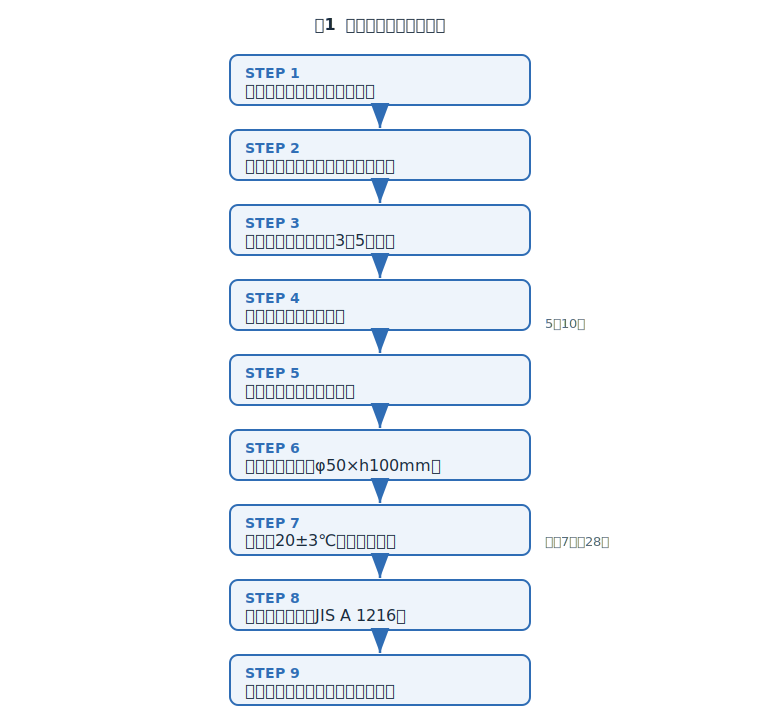
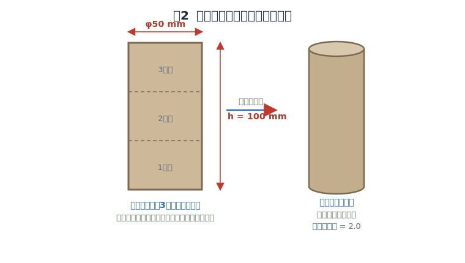
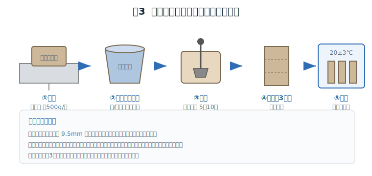
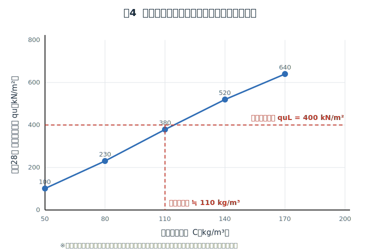
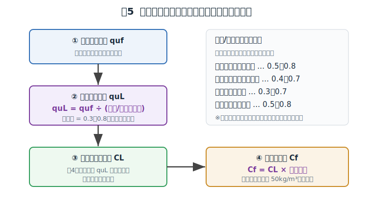

# 柱状改良 事前（室内）配合試験マニュアル
### ― セメント添加量を決定するための試験方法 ―

**作成日：2026年6月9日**

---

## 0. 本マニュアルの目的

柱状改良（セメント系固化材を用いた深層混合処理／コラム式地盤改良）では、
所定の改良強度を確実に得るために、**施工に先立って対象土と固化材を実際に混ぜ、
強度と添加量の関係を把握する「事前配合試験（室内配合試験）」** を行います。

本マニュアルは、

- どのような手順で試験を行うか（図解）
- 供試体をどう作るか
- 試験結果から **現場でのセメント添加量をどう決めるか**

を、現場担当者・試験担当者が参照できるよう一連の流れでまとめたものです。

> ⚠️ **位置づけ**：本書はウェブ上で公開されている各種技術資料（地盤工学会基準、
> セメント協会マニュアル、住宅地盤品質協会推奨案 等）を整理した**実務用の手引き**です。
> 実際の試験・設計にあたっては、末尾「参考資料」の原典および発注者の仕様書を必ず確認してください。

---

## 1. 適用範囲・準拠基準

| 項目 | 内容 |
|------|------|
| 対象工法 | 柱状改良（機械撹拌式深層混合処理、コラムジェット等を含む） |
| 対象土 | 粘性土・砂質土など（**最大粒径 9.5 mm 以下**にふるい分けて使用） |
| 固化材 | セメント系固化材（普通ポルトランドセメント、一般軟弱土用・特殊土用固化材 等） |
| 添加方式 | スラリー添加（標準）／粉体添加 |

**主な準拠基準・参考図書**

- **JGS 0821**：安定処理土の締固めをしない供試体作製方法（スラリー状の試料に標準）
- **JGS 0811**：安定処理土の突固めによる供試体作製方法
- **JIS A 1216**：土の一軸圧縮試験方法
- **セメント協会「セメント系固化材による地盤改良マニュアル（第5版）」**
- **NPO住宅地盤品質協会「改良土の室内配合試験（案）T003-2011」**

---

## 2. 試験全体のフロー

事前配合試験は、試料採取から添加量決定まで次の9ステップで進めます。



1. **試料採取** … 改良対象層の土を採取
2. **設計条件の整理・目標強度の設定**
3. **添加量水準の設定**（3〜5水準）
4. **固化材スラリーの作製**
5. **混合・撹拌**（ミキサーで5〜10分）
6. **供試体の作製**（φ50 × h100 mm）
7. **養生**（20±3℃、湿空養生）
8. **一軸圧縮試験**（JIS A 1216）
9. **添加量の決定 → 現場添加量への換算**

---

## 3. 事前準備

### 3.1 試料の採取・調整

- 改良対象層から土を採取する。ボーリングコアや試掘土を用いる。
- **自然含水比の状態**で持ち帰り、礫・木片・草根などの夾雑物を除去。
- **最大粒径 9.5 mm 以下**にふるい分ける。
- 供試体1本あたり、湿潤土で **約 500 g** を目安に必要量を確保する。
  （水準数 × 材齢数 × 各3本以上、を見込んで試料量を準備）

### 3.2 設計条件の整理（目標強度の設定）

- 構造計算から求まる **設計基準強度 quf**（現場で必要な一軸圧縮強度）を確認。
- 後述（第7章）の **(現場/室内)強さ比** を用い、**室内目標強度 quL** を設定する。

```
室内目標強度 quL = 設計基準強度 quf ÷ (現場/室内)強さ比
```

### 3.3 添加量水準の設定

- 過去のデータ等から「所要強度が得られそうな添加量」を中心に置き、
  その前後で **3〜5水準** を設定する。
- 例：80 / 110 / 140 / 170 kg/m³ のように等間隔に振る。
- 単位は **改良対象土 1 m³ あたりの固化材質量（kg/m³）** で管理するのが一般的。

> **最小添加量の目安**：基礎地盤の改良では概ね **50 kg/m³ 以上** を確保する
> （対象土・固化材種により異なるため固化材メーカー資料も確認）。

---

## 4. 供試体の作製

### 4.1 標準寸法

供試体・モールドの標準寸法は **直径 φ50 mm × 高さ h100 mm（高さ/直径 = 2.0）** です。



### 4.2 固化材スラリーの作製（スラリー添加の場合）

- 設定した添加量と **水固化材比（W/C）** に基づき、水と固化材を計量。
- スラリーは分離しないよう、使用直前に十分に撹拌して均一にする。
- 粉体添加で試験する場合はスラリーを作らず、固化材粉末を直接土に加える。

> **添加量とスラリー量の換算（考え方）**
> 1 m³ の改良土に対し固化材 C（kg）を、水固化材比 W/C で加える場合、
> スラリー中の水量は W = C ×(W/C)（kg）。室内では試料 500 g 規模に縮尺して
> 同じ単位体積あたり添加量になるよう計量する。

### 4.3 混合・撹拌



1. 計量した土に固化材（スラリーまたは粉体）を加える。
2. **ミキサーで 5〜10 分程度**、均一になるまで混合する。
3. モールド内壁に試料が付着して撹拌できなくなったら混合を止め、
   **ヘラでかき落として再混合**し、十分に練り混ぜる。

### 4.4 モールドへの充填

- 混合した改良土を、モールドに **3層程度**に分けて充填する。
- **各層ごとに気泡を抜く**（タッピングや軽い突き）。
  気泡が残ると強度のばらつき・低下の原因になる。
- 上端を均し、識別ラベル（添加量・材齢・作製日）を付ける。
- **同一条件で3本以上**作製し、平均値を採用する。

---

## 5. 養生

| 項目 | 標準 |
|------|------|
| 温度 | **20 ± 3 ℃**（恒温養生室） |
| 方法 | 湿空養生（乾燥を防ぐためラップ・密封等）。砂質土等では水中養生とする場合もある |
| 材齢 | **28日養生を標準**。工期の都合で **材齢7日**で確認することも多い |

> 💡 **材齢7日と28日**：7日強度はあくまで早期確認用。最終的な配合判断は
> 28日強度（または7日→28日の強度増進を見込んだ補正）で行うのが原則。

養生後、供試体を脱型し、**端面を平面に成形**してから試験に供する。

---

## 6. 一軸圧縮試験（JIS A 1216）

- 拘束圧のかからない状態で供試体を軸方向に圧縮し、**最大圧縮応力 = 一軸圧縮強度 qu** を求める。
- 同一条件3本の平均を、その添加量・材齢の代表値とする。
- 各添加量水準の qu をプロットし、**「添加量 〜 一軸圧縮強度」関係曲線**を作成する。



---

## 7. 添加量の決定（現場添加量への換算）

室内試験の結果（室内強度）と、施工後の現場強度には差があるため、
**(現場/室内)強さ比**で補正して現場添加量を決定します。



### 7.1 手順

1. **設計基準強度 quf** を確認する。
2. **室内目標強度 quL** を求める。
   ```
   quL = quf ÷ (現場/室内)強さ比
   ```
3. 図4の関係曲線から、**quL に対応する室内必要添加量 CL** を読み取る。
4. **現場添加量 Cf** を求める。
   ```
   Cf = CL × 割増係数
   ```
   （割増係数 = 1 + 割増率%×1/100。施工ばらつきを見込む）
5. 最小添加量（例：50 kg/m³）を下回らないか確認する。

### 7.2 (現場/室内)強さ比の目安

セメント協会マニュアルでは、添加方式・対象土・施工機械により下表の目安が示されています。
（**安全側は小さい値**を採る）

| 添加方式 | 施工機械 | (現場/室内)強さ比の目安 |
|----------|----------|------------------------|
| スラリー | 機械撹拌（スタビライザ等） | 0.5 〜 0.8 |
| スラリー | バックホウ | 0.4 〜 0.7 |
| 粉体 | 機械撹拌 | 0.3 〜 0.7 |
| 粉体 | バックホウ | 0.5 〜 0.8 |

### 7.3 計算例

| 項目 | 値 |
|------|-----|
| 設計基準強度 quf | 200 kN/m² |
| (現場/室内)強さ比（中間値の例） | 0.5 |
| **室内目標強度 quL** | 200 ÷ 0.5 = **400 kN/m²** |
| 図4より quL=400 に対応する室内添加量 CL | 約 110 kg/m³ |
| 割増係数（例 10%増し） | 1.10 |
| **現場添加量 Cf** | 110 × 1.10 ≒ **121 kg/m³** |

> 上表の数値はすべて**例示**です。実際は採取土ごとの試験結果と、
> 工法・施工機械・発注者仕様に応じた強さ比・割増係数を用いてください。

---

## 8. 試験記録様式（例）

| 試料No. | 対象層・深度 | 土質 | 自然含水比 |
|---------|--------------|------|-----------|
|  |  |  |  |

| 添加量 (kg/m³) | 材齢 (日) | qu-1 | qu-2 | qu-3 | 平均 qu (kN/m²) |
|----------------|-----------|------|------|------|----------------|
| 80  | 7 / 28 |  |  |  |  |
| 110 | 7 / 28 |  |  |  |  |
| 140 | 7 / 28 |  |  |  |  |
| 170 | 7 / 28 |  |  |  |  |

| 設計基準強度 quf | 強さ比 | 室内目標強度 quL | 室内必要添加量 CL | 割増係数 | **現場添加量 Cf** |
|------------------|--------|------------------|-------------------|----------|------------------|
|  |  |  |  |  |  |

---

## 9. チェックリスト

- [ ] 試料は改良対象層から、自然含水比で採取したか
- [ ] 最大粒径 9.5 mm 以下にふるい分けたか
- [ ] 添加量を3〜5水準、設計値を挟んで設定したか
- [ ] 供試体は φ50×h100 mm、同一条件3本以上作製したか
- [ ] 各層の気泡を除去したか
- [ ] 20±3℃で所定材齢まで養生したか
- [ ] 一軸圧縮試験は JIS A 1216 に準拠したか
- [ ] (現場/室内)強さ比・割増係数を適切に選定したか
- [ ] 最小添加量を満たしているか

---

## 10. 参考資料（出典）

- 地盤工学会基準 **JGS 0821**「安定処理土の締固めをしない供試体作製方法」／**JGS 0811**「突固めによる供試体作製方法」
- **JIS A 1216**「土の一軸圧縮試験方法」
- 一般社団法人セメント協会「**セメント系固化材による地盤改良マニュアル（第5版）**」
- NPO住宅地盤品質協会「**改良土の室内配合試験（案）T003-2011**」
  https://www.juhinkyo.jp/wp-content/uploads/2013/12/T003-2011.pdf
- 国土技術政策総合研究所「セメント系改良土の適正な配合・施工方法について」
  https://www.nilim.go.jp/lab/bcg/siryou/tnn/tnn0531pdf/ks053108.pdf
- 協同組合土質屋北陸「安定処理土の室内配合試験」
  https://doshitsuya.or.jp/examination2.html
- 興亜開発（株）「室内配合試験」
  https://www.koa-kaihatsu.co.jp/service/geo/lab/laboratory_mixing_test
- 建設技術センター「配合試験（地盤改良）」
  https://www.ctc-kengi.co.jp/investigation/i06/
- 全地連 技術e-フォーラム2002「地盤改良のための改良材の添加量について」
  https://www.zenchiren.or.jp/e-Forum/2002/025.PDF

> 図はすべて本マニュアル用に作成した模式図です（`figures/` フォルダ内 SVG）。
